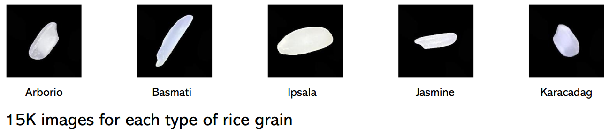
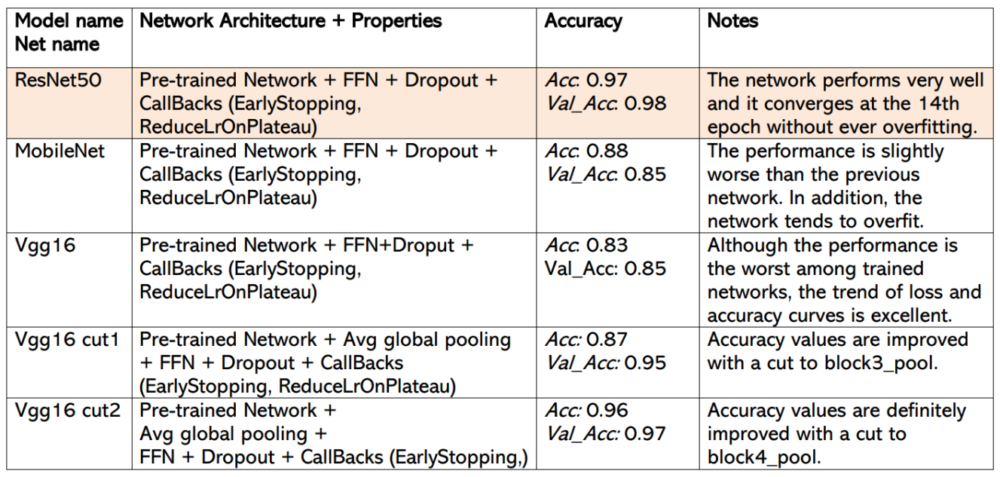

# Foundations_of_Deep_Learning_Project
Rice grain image classification with CNNs

**DATASET**: https://www.muratkoklu.com/datasets/  
Dataset containing 75000 images belonging to 5 rice classes: Arborio, Basmati, Ipsala, Jasmine and Karadak

Main steps:

- Understanding of the Dataset
- Loading and Sampling
- EDA: Exploratory Data Analysis
- Preprocessing + Splitting data into Training and Validation Set
-  Classification: Neural Network from scratch and Transfer Learning
- Selection and Comparison of the Best Models
- Fitting on Test data and Best Model Choice

Main Results from scratch:

| Model Name  | Network Architecure + Properties | Accuracy Train | Accuracy Validation | Notes        	                          |
| ----------- | -------------------------------- | -------------- | ------------------- | --------------------------------------- |
| Modelv1 | 2CNN (32, 64) | 0.95 | 0.88 | From the 30th epoch onward the model remains stable. Despite having very good performance and there seems to be no presence of overfitting it is decided to increase the stability of the model in the next steps. |
| Modelv2 | 2CNN (32, 64) batch_norm. | 0.97 | 0.88 | Very unstable model.   The complexity of the convolutional layer is increased. |
| Modelv3 | 3 CNN (32, 64, 128) + batch_norm. | 0.98 | 0.86 | Very unstable model. Accuracy decreased.   The regularization term is added. |
| Modelv4l1 | 3 CNN (32, 64, 128) + batch_norm + lasso_regular. | 0.97 | 0.65 | Very unstable model. As in the previous cases the Accuracy (on training) is very high while on validation  |
| Modelv4l2 | 3 CNN (32, 64, 128) + batch_norm + ridge_regular. | 0.98 | 0.88 | Accuracy on validation is higher than that of the previous model (lasso regularization).   The model is more sable in the last 5 epochs (35th onwards).   Complexity in the fully connected part is increased. |
| Modelv4l2_5 | 3 CNN (32, 64, 128) + batch_norm + ridge_regular. + early_stop. | 0.97 | 0.92 | Accuracy is increased. |
| Modelv4_5 | 3 CNN (32, 64, 128) + batch_norm + 1 FC (64) | 0.98 | 0.81 | Very unstable model. Accuracy on validation has decreased significantly compared to that obtained in *Modelv412*.   However, it is tried to increase the complexity of the fully connected layer again. |
| Modelv5 | 3 CNN (32, 64, 128) + batch_norm + 2 FC (128, 64) | 0.98 | 0.82 | Accuracy has improved by 1%. Despite this improvement the performance of *Modelv412* (with only output dense layer) seems to be better.   We change the weight initialization algorithm in the convolutional layers.   We insert the He initializer because it might work better in convolutional layers where the activation function is a ReLU. |
| Modelv6 | 3 CNN (32, 64, 128) + batch_norm + ridge_regular. + He weight inizialization | 0.98 | 0.93 | The algorithm converges very early. The final performance at the 40th epoch is very high, compared with previous networks. Nevertheless, it turns out to be somewhat unstable in the later epochs.   Early Stopping mechanism is implemented. |
| Model v6_5 | 3 CNN (32, 64, 128) + batch_norm + ridge_regular. + He weight inizialization + early_stop | 0.98 | 0.95 | The reducing learning rate mechanism is added to try to make the model more stable and increase its performance. |
| Model v7 | 3 CNN (32, 64, 128) + batch_norm + ridge_regular. + He weight inizialization + Reduce learning rate | 0.996 | 0.98 | The model achieves very good performance on both training and validation. In addition, the model is very stable in the 20th epoch onwards. |

Main Results transfer learning:

# How to run the code

Unless otherwise specified in the notebook section all codes can be runned in Google Colaboratory platform. All notebooks all already setted to import the necessary packages and also in this way you can easily use a GPU!

# References

[1] Koklu, M., Cinar, I., & Taspinar, Y. S. (2021). Classification of rice varieties with deep learning methods. Computers and Electronics in Agriculture, 187, 106285. https://doi.org/10.1016/j.compag.2021.106285

[2] Cinar, I., & Koklu, M. (2021). Determination of Effective and Specific Physical Features of Rice Varieties by Computer Vision In Exterior Quality Inspection. Selcuk Journal of Agriculture and Food Sciences, 35(3), 229-243. https://doi.org/10.15316/SJAFS.2021.252

[3] Cinar, I., & Koklu, M. (2022). Identification of Rice Varieties Using Machine Learning Algorithms. Journal of Agricultural Sciences https://doi.org/10.15832/ankutbd.862482

[4] Cinar, I., & Koklu, M. (2019). Classification of Rice Varieties Using Artificial Intelligence Methods. International Journal of Intelligent Systems and Applications in Engineering, 7(3), 188-194. https://doi.org/10.18201/ijisae.2019355381
