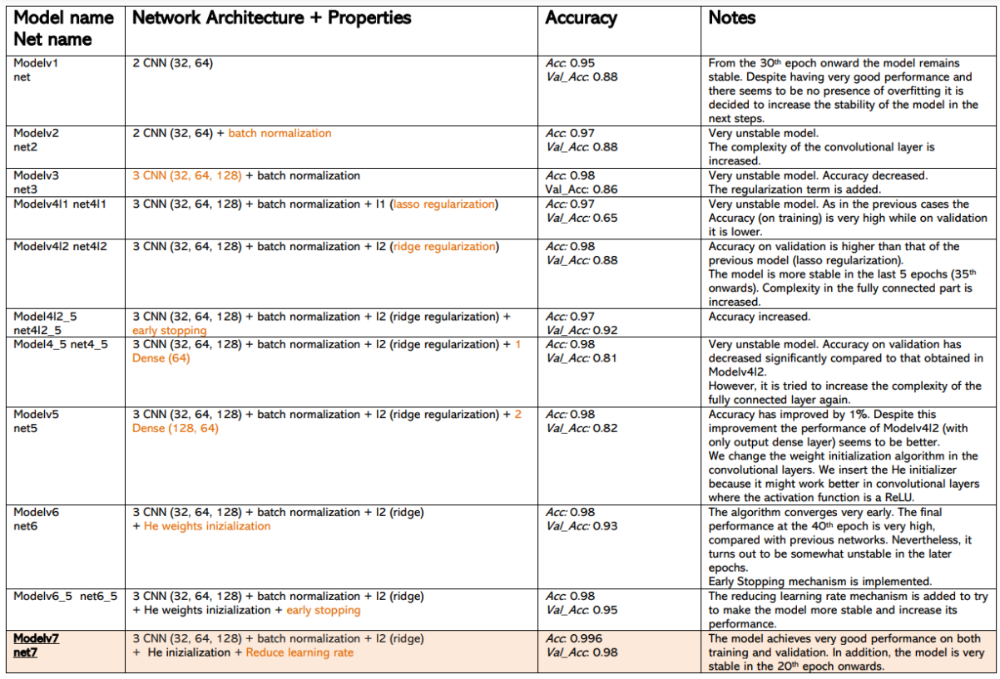

# Foundations_of_Deep_Learning_Project
Rice grain image classification with CNNs

**DATASET**: https://www.muratkoklu.com/datasets/  
Dataset containing 75000 images belonging to 5 rice classes: Arborio, Basmati, Ipsala, Jasmine and Karadak

Main steps:

• Understanding of the Dataset
• Loading and Sampling
• EDA: Exploratory Data Analysis
• Preprocessing + Splitting data into Training and Validation
Set
• Classification: Neural Network from scratch and Transfer
Learning
• Selection and Comparison of the Best Models
• Fitting on Test data and Best Model Choice

Main Results from scratch:

Main Results transfer learning:

# How to run the code

Unless otherwise specified in the notebook section all codes can be runned in Google Colaboratory platform. All notebooks all already setted to import the necessary packages and also in this way you can easily use a GPU!

# References

[1] Koklu, M., Cinar, I., & Taspinar, Y. S. (2021). Classification of rice varieties with deep learning methods. Computers and Electronics in Agriculture, 187, 106285. https://doi.org/10.1016/j.compag.2021.106285

[2] Cinar, I., & Koklu, M. (2021). Determination of Effective and Specific Physical Features of Rice Varieties by Computer Vision In Exterior Quality Inspection. Selcuk Journal of Agriculture and Food Sciences, 35(3), 229-243. https://doi.org/10.15316/SJAFS.2021.252

[3] Cinar, I., & Koklu, M. (2022). Identification of Rice Varieties Using Machine Learning Algorithms. Journal of Agricultural Sciences https://doi.org/10.15832/ankutbd.862482

[4] Cinar, I., & Koklu, M. (2019). Classification of Rice Varieties Using Artificial Intelligence Methods. International Journal of Intelligent Systems and Applications in Engineering, 7(3), 188-194. https://doi.org/10.18201/ijisae.2019355381
